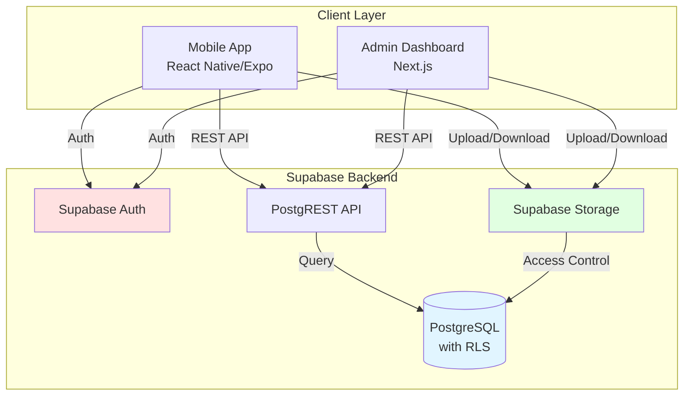
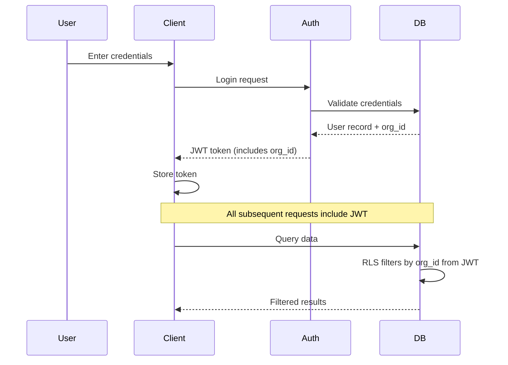

# Design Document: Multi-Organization Employee Time & Attendance Management System

## Overview

The Multi-Organization Employee Time & Attendance Management System is a multi-tenant SaaS application that enables organizations to track employee attendance with photo verification. The system architecture consists of three main components:

1. **Employee Mobile Application** (React Native/Expo): Enables employees to log time in/out with photo verification and view their personal attendance history
2. **Admin Web Dashboard** (Next.js): Provides administrators with employee management, attendance monitoring, reporting, and photo verification capabilities
3. **Backend Infrastructure** (Supabase): PostgreSQL database with Row Level Security, authentication services, and cloud storage for photos

The design emphasizes security through multi-tenant data isolation using PostgreSQL Row Level Security (RLS), ensuring complete separation of organizational data. The system enforces business rules at multiple layers (application, database, and storage) to maintain data integrity and prevent unauthorized access.

## Architecture

### System Architecture Diagram



### Multi-Tenant Architecture

The system implements multi-tenancy at the database level using Row Level Security (RLS):

- Each organization is completely isolated from others
- All queries automatically filter by `organization_id`
- RLS policies enforce access control at the PostgreSQL level
- No application-level filtering required for basic tenant isolation

### Authentication Flow



## Components and Interfaces

### Database Schema

#### Organizations Table
```sql
CREATE TABLE organizations (
    id UUID PRIMARY KEY DEFAULT gen_random_uuid(),
    name TEXT NOT NULL,
    created_at TIMESTAMPTZ DEFAULT NOW(),
    created_by UUID REFERENCES users(id)
);
```

#### Users Table
```sql
CREATE TABLE users (
    id UUID PRIMARY KEY DEFAULT gen_random_uuid(),
    organization_id UUID NOT NULL REFERENCES organizations(id) ON DELETE CASCADE,
    full_name TEXT NOT NULL,
    username TEXT NOT NULL UNIQUE,
    password_hash TEXT NOT NULL,
    role TEXT NOT NULL CHECK (role IN ('admin', 'employee')),
    must_change_password BOOLEAN DEFAULT FALSE,
    is_active BOOLEAN DEFAULT TRUE,
    created_at TIMESTAMPTZ DEFAULT NOW(),
    UNIQUE(organization_id, username)
);

CREATE INDEX idx_users_org ON users(organization_id);
CREATE INDEX idx_users_username ON users(username);
```

#### Time Logs Table
```sql
CREATE TABLE time_logs (
    id UUID PRIMARY KEY DEFAULT gen_random_uuid(),
    organization_id UUID NOT NULL REFERENCES organizations(id) ON DELETE CASCADE,
    user_id UUID NOT NULL REFERENCES users(id) ON DELETE CASCADE,
    date DATE NOT NULL,
    time_in TIMESTAMPTZ,
    time_in_photo_url TEXT,
    time_out TIMESTAMPTZ,
    time_out_photo_url TEXT,
    total_hours DECIMAL(5,2),
    status TEXT NOT NULL DEFAULT 'incomplete' CHECK (status IN ('completed', 'missing', 'incomplete')),
    created_at TIMESTAMPTZ DEFAULT NOW(),
    updated_at TIMESTAMPTZ DEFAULT NOW(),
    UNIQUE(organization_id, user_id, date)
);

CREATE INDEX idx_time_logs_org ON time_logs(organization_id);
CREATE INDEX idx_time_logs_user ON time_logs(user_id);
CREATE INDEX idx_time_logs_date ON time_logs(date);
CREATE INDEX idx_time_logs_status ON time_logs(status);
```

### Row Level Security Policies

#### Organizations Table RLS
```sql
ALTER TABLE organizations ENABLE ROW LEVEL SECURITY;

-- Users can only see their own organization
CREATE POLICY org_isolation ON organizations
    FOR ALL
    USING (id = (SELECT organization_id FROM users WHERE id = auth.uid()));
```

#### Users Table RLS
```sql
ALTER TABLE users ENABLE ROW LEVEL SECURITY;

-- Users can see other users in their organization
CREATE POLICY users_org_isolation ON users
    FOR SELECT
    USING (organization_id = (SELECT organization_id FROM users WHERE id = auth.uid()));

-- Only admins can insert/update/delete users in their organization
CREATE POLICY users_admin_manage ON users
    FOR ALL
    USING (
        organization_id = (SELECT organization_id FROM users WHERE id = auth.uid())
        AND (SELECT role FROM users WHERE id = auth.uid()) = 'admin'
    );
```

#### Time Logs Table RLS
```sql
ALTER TABLE time_logs ENABLE ROW LEVEL SECURITY;

-- Employees can only see their own logs
CREATE POLICY time_logs_employee_own ON time_logs
    FOR SELECT
    USING (
        user_id = auth.uid()
        AND organization_id = (SELECT organization_id FROM users WHERE id = auth.uid())
    );

-- Admins can see all logs in their organization
CREATE POLICY time_logs_admin_all ON time_logs
    FOR SELECT
    USING (
        organization_id = (SELECT organization_id FROM users WHERE id = auth.uid())
        AND (SELECT role FROM users WHERE id = auth.uid()) = 'admin'
    );

-- Employees can insert/update their own logs
CREATE POLICY time_logs_employee_manage ON time_logs
    FOR INSERT, UPDATE
    USING (
        user_id = auth.uid()
        AND organization_id = (SELECT organization_id FROM users WHERE id = auth.uid())
    );
```

### API Interfaces

#### Authentication Endpoints

**POST /auth/register-admin**
```typescript
Request: {
    full_name: string;
    username: string;
    password: string;
    organization_name: string;
}

Response: {
    user_id: string;
    organization_id: string;
    access_token: string;
    refresh_token: string;
}
```

**POST /auth/login**
```typescript
Request: {
    username: string;
    password: string;
}

Response: {
    user_id: string;
    organization_id: string;
    role: 'admin' | 'employee';
    must_change_password: boolean;
    access_token: string;
    refresh_token: string;
}
```

**POST /auth/change-password**
```typescript
Request: {
    current_password: string;
    new_password: string;
}

Response: {
    success: boolean;
    message: string;
}
```

#### Employee Management Endpoints

**POST /admin/employees**
```typescript
Request: {
    full_name: string;
}

Response: {
    user_id: string;
    username: string;
    password: string; // temporary password
    full_name: string;
}
```

**GET /admin/employees**
```typescript
Response: {
    employees: Array<{
        user_id: string;
        full_name: string;
        username: string;
        is_active: boolean;
        created_at: string;
    }>;
}
```

**PATCH /admin/employees/:id/deactivate**
```typescript
Response: {
    success: boolean;
    message: string;
}
```

**POST /admin/employees/:id/reset-password**
```typescript
Response: {
    new_password: string;
    message: string;
}
```

#### Time Logging Endpoints

**POST /time-logs/time-in**
```typescript
Request: {
    photo: File; // multipart/form-data
    timestamp: string; // ISO 8601
}

Response: {
    log_id: string;
    time_in: string;
    photo_url: string;
}
```

**PATCH /time-logs/time-out**
```typescript
Request: {
    photo: File; // multipart/form-data
    timestamp: string; // ISO 8601
}

Response: {
    log_id: string;
    time_out: string;
    total_hours: number;
    photo_url: string;
}
```

**GET /time-logs/my-logs**
```typescript
Query Parameters: {
    start_date?: string; // YYYY-MM-DD
    end_date?: string; // YYYY-MM-DD
    limit?: number;
    offset?: number;
}

Response: {
    logs: Array<{
        log_id: string;
        date: string;
        time_in: string | null;
        time_out: string | null;
        total_hours: number | null;
        status: 'completed' | 'missing' | 'incomplete';
        time_in_photo_url: string | null;
        time_out_photo_url: string | null;
    }>;
    total_count: number;
}
```

#### Admin Reporting Endpoints

**GET /admin/daily-attendance**
```typescript
Query Parameters: {
    date: string; // YYYY-MM-DD
}

Response: {
    date: string;
    employees: Array<{
        user_id: string;
        full_name: string;
        time_in: string | null;
        time_out: string | null;
        total_hours: number | null;
        status: 'completed' | 'missing' | 'not_logged_in';
        time_in_photo_url: string | null;
        time_out_photo_url: string | null;
    }>;
}
```

**GET /admin/weekly-report**
```typescript
Query Parameters: {
    start_date: string; // YYYY-MM-DD (Monday)
}

Response: {
    week_start: string;
    week_end: string;
    employees: Array<{
        user_id: string;
        full_name: string;
        total_hours: number;
        days_worked: number;
        missing_time_outs: number;
        days_not_logged: number;
    }>;
    organization_totals: {
        total_hours: number;
        total_days_worked: number;
    };
}
```

**GET /admin/dashboard-overview**
```typescript
Response: {
    total_employees: number;
    active_employees: number;
    logged_in_today: number;
    missing_time_outs_today: number;
    total_hours_today: number;
}
```

### Storage Structure

Supabase Storage bucket: `attendance-photos`

Path structure:
```
attendance-photos/
  {organization_id}/
    {user_id}/
      {YYYY-MM-DD}_time_in.jpg
      {YYYY-MM-DD}_time_out.jpg
```

Storage policies:
```sql
-- Employees can upload their own photos
CREATE POLICY employee_upload ON storage.objects
    FOR INSERT
    WITH CHECK (
        bucket_id = 'attendance-photos'
        AND (storage.foldername(name))[1] = (SELECT organization_id::text FROM users WHERE id = auth.uid())
        AND (storage.foldername(name))[2] = auth.uid()::text
    );

-- Employees can read their own photos
CREATE POLICY employee_read_own ON storage.objects
    FOR SELECT
    USING (
        bucket_id = 'attendance-photos'
        AND (storage.foldername(name))[1] = (SELECT organization_id::text FROM users WHERE id = auth.uid())
        AND (storage.foldername(name))[2] = auth.uid()::text
    );

-- Admins can read all photos in their organization
CREATE POLICY admin_read_org ON storage.objects
    FOR SELECT
    USING (
        bucket_id = 'attendance-photos'
        AND (storage.foldername(name))[1] = (SELECT organization_id::text FROM users WHERE id = auth.uid())
        AND (SELECT role FROM users WHERE id = auth.uid()) = 'admin'
    );
```

## Data Models

### Organization Model
```typescript
interface Organization {
    id: string; // UUID
    name: string;
    created_at: string; // ISO 8601
    created_by: string; // UUID
}
```

### User Model
```typescript
interface User {
    id: string; // UUID
    organization_id: string; // UUID
    full_name: string;
    username: string;
    password_hash: string; // bcrypt hash
    role: 'admin' | 'employee';
    must_change_password: boolean;
    is_active: boolean;
    created_at: string; // ISO 8601
}
```

### Time Log Model
```typescript
interface TimeLog {
    id: string; // UUID
    organization_id: string; // UUID
    user_id: string; // UUID
    date: string; // YYYY-MM-DD
    time_in: string | null; // ISO 8601
    time_in_photo_url: string | null;
    time_out: string | null; // ISO 8601
    time_out_photo_url: string | null;
    total_hours: number | null; // Decimal(5,2)
    status: 'completed' | 'missing' | 'incomplete';
    created_at: string; // ISO 8601
    updated_at: string; // ISO 8601
}
```

### Business Logic Models

#### Username Generation
```typescript
function generateUsername(fullName: string, organizationId: string): string {
    // Convert full name to lowercase, remove spaces
    const baseName = fullName.toLowerCase().replace(/\s+/g, '');
    
    // Check if username exists in organization
    let username = baseName;
    let counter = 1;
    
    while (usernameExists(username, organizationId)) {
        username = `${baseName}${counter}`;
        counter++;
    }
    
    return username;
}
```

#### Password Generation
```typescript
function generateSecurePassword(): string {
    // Generate 12-character password with:
    // - Uppercase letters
    // - Lowercase letters
    // - Numbers
    // - Special characters
    const charset = 'ABCDEFGHIJKLMNOPQRSTUVWXYZabcdefghijklmnopqrstuvwxyz0123456789!@#$%^&*';
    const length = 12;
    
    let password = '';
    const crypto = require('crypto');
    
    for (let i = 0; i < length; i++) {
        const randomIndex = crypto.randomInt(0, charset.length);
        password += charset[randomIndex];
    }
    
    // Ensure password meets requirements
    if (!validatePassword(password)) {
        return generateSecurePassword(); // Retry
    }
    
    return password;
}
```

#### Total Hours Calculation
```typescript
function calculateTotalHours(timeIn: Date, timeOut: Date): number {
    const diffMs = timeOut.getTime() - timeIn.getTime();
    const diffHours = diffMs / (1000 * 60 * 60);
    return Math.round(diffHours * 100) / 100; // Round to 2 decimal places
}
```

#### Photo URL Generation
```typescript
function generatePhotoUrl(
    organizationId: string,
    userId: string,
    date: string,
    type: 'time_in' | 'time_out'
): string {
    return `${organizationId}/${userId}/${date}_${type}.jpg`;
}
```


## Correctness Properties

A property is a characteristic or behavior that should hold true across all valid executions of a system—essentially, a formal statement about what the system should do. Properties serve as the bridge between human-readable specifications and machine-verifiable correctness guarantees.

### Property 1: Row Level Security Data Isolation

*For any* authenticated user and any database query, the returned results should only include records where the organization_id matches the user's organization_id.

**Validates: Requirements 1.2**

### Property 2: Admin Registration Creates Organization

*For any* valid admin registration data (full name, username, password, organization name), completing the registration should create exactly one new organization record.

**Validates: Requirements 2.1**

### Property 3: Admin Linked to Created Organization

*For any* admin registration, the created admin user's organization_id should match the id of the newly created organization.

**Validates: Requirements 2.2**

### Property 4: Username Uniqueness Within Organization

*For any* set of employees created within an organization, all generated usernames should be unique within that organization.

**Validates: Requirements 3.2**

### Property 5: Generated Password Security Requirements

*For any* auto-generated password, it should meet security requirements: minimum 8 characters, at least one uppercase letter, one lowercase letter, and one number.

**Validates: Requirements 3.3**

### Property 6: New Employee Must Change Password

*For any* newly created employee account, the must_change_password field should be set to true.

**Validates: Requirements 3.4**

### Property 7: First Login Requires Password Change

*For any* employee with must_change_password set to true, authentication should return a response indicating password change is required before accessing other features.

**Validates: Requirements 4.1**

### Property 8: Password Change Clears Flag

*For any* employee with must_change_password set to true, after a successful password change, the must_change_password field should be set to false.

**Validates: Requirements 4.3**

### Property 9: Duplicate Time In Prevention

*For any* employee and date, if a time_in record already exists for that date, attempting to create another time_in for the same date should be rejected.

**Validates: Requirements 5.5**

### Property 10: Total Hours Calculation Accuracy

*For any* time log with both time_in and time_out, the total_hours field should equal (time_out - time_in) converted to hours with two decimal places of precision.

**Validates: Requirements 6.5**

### Property 11: Time Out After Time In Validation

*For any* time out attempt, if the time_out timestamp is before or equal to the time_in timestamp, the request should be rejected.

**Validates: Requirements 6.8**

### Property 12: Employee Log View Isolation

*For any* employee accessing their log view, the returned time logs should only include records where the user_id matches the authenticated employee's id.

**Validates: Requirements 7.1**

### Property 13: Missing Time Out Detection

*For any* set of time logs where time_in exists but time_out is null after the date has passed, the system should identify these records and set their status to 'missing'.

**Validates: Requirements 8.1, 8.2**

### Property 14: Admin Employee List Organization Isolation

*For any* admin accessing employee management, the returned employee list should include all employees where organization_id matches the admin's organization_id, and no employees from other organizations.

**Validates: Requirements 9.1**

### Property 15: Deactivated Employee Authentication Rejection

*For any* user with is_active set to false, authentication attempts should fail regardless of whether the credentials are correct.

**Validates: Requirements 9.5, 14.5**

### Property 16: Photo Access Organization Boundary

*For any* photo access request, access should be granted only if the requesting user's organization_id matches the organization_id in the photo's path.

**Validates: Requirements 13.2, 13.3**

### Property 17: Employee Photo Access User Boundary

*For any* employee requesting photo access, access should be granted only if the employee's user_id matches the user_id in the photo's path and the organization_id matches.

**Validates: Requirements 13.4**

### Property 18: Valid Credentials Authentication Success

*For any* user with valid username and password and is_active set to true, authentication should succeed and return a valid session token.

**Validates: Requirements 14.1**

### Property 19: Password Validation Requirements

*For any* password input during registration or password change, passwords that don't meet requirements (minimum 8 characters, at least one uppercase, one lowercase, one number) should be rejected.

**Validates: Requirements 14.6**

### Property 20: Admin Time Log Access Within Organization

*For any* admin querying time logs, the results should include all time logs where organization_id matches the admin's organization_id, regardless of which employee created them.

**Validates: Requirements 15.6**

### Property 21: ISO 8601 Timestamp Validation

*For any* timestamp input, timestamps that are not in valid ISO 8601 format should be rejected, and valid ISO 8601 timestamps should be accepted.

**Validates: Requirements 16.4**

### Property 22: Photo Upload File Type and Size Validation

*For any* file upload to photo storage, files that are not valid image types or exceed size limits should be rejected.

**Validates: Requirements 16.5**

### Property 23: Password Reset Sets Change Flag

*For any* password reset operation performed by an admin, the target employee's must_change_password field should be set to true.

**Validates: Requirements 18.3**

### Property 24: Duplicate Time Out Prevention

*For any* employee and date, if a time_out record already exists for that date, attempting to update with another time_out for the same date should be rejected.

**Validates: Requirements 19.2**

### Property 25: Date Format Validation

*For any* date input, dates that are not in YYYY-MM-DD format should be rejected, and valid YYYY-MM-DD dates should be accepted.

**Validates: Requirements 19.6**

### Property 26: Time Format Validation

*For any* time input, times that are not in HH:MM:SS format should be rejected, and valid HH:MM:SS times should be accepted.

**Validates: Requirements 19.7**

## Error Handling

### Error Categories

The system implements comprehensive error handling across multiple categories:

1. **Authentication Errors**
   - Invalid credentials
   - Expired session tokens
   - Inactive user accounts
   - Rate limit exceeded

2. **Authorization Errors**
   - Cross-organization data access attempts
   - Insufficient permissions (employee trying admin operations)
   - Photo access violations

3. **Validation Errors**
   - Invalid input formats (dates, times, timestamps)
   - Missing required fields
   - Constraint violations (duplicate time in/out)
   - Password requirement failures
   - File type/size violations

4. **Business Rule Errors**
   - Time out before time in
   - Duplicate time logging attempts
   - Operations on deactivated accounts

5. **System Errors**
   - Database connection failures
   - Storage upload/download failures
   - External service unavailability

### Error Response Format

All API errors follow a consistent format:

```typescript
interface ErrorResponse {
    error: {
        code: string; // Machine-readable error code
        message: string; // Human-readable error message
        details?: any; // Optional additional context
        timestamp: string; // ISO 8601 timestamp
    };
}
```

### Error Handling Strategies

**Client-Side (Mobile App & Admin Dashboard)**:
- Display user-friendly error messages
- Implement retry logic for transient failures
- Cache data locally when offline
- Validate inputs before submission
- Handle photo upload failures gracefully

**Server-Side (Supabase Functions)**:
- Wrap all database operations in try-catch blocks
- Log detailed error information for debugging
- Return generic error messages to clients (avoid leaking sensitive info)
- Implement circuit breakers for external services
- Use database transactions for multi-step operations

**Database-Level**:
- Enforce constraints at schema level (UNIQUE, CHECK, FOREIGN KEY)
- Use RLS policies to prevent unauthorized access
- Implement triggers for business rule enforcement
- Use database-level validation functions

### Specific Error Scenarios

**Duplicate Time In Attempt**:
```typescript
{
    error: {
        code: "DUPLICATE_TIME_IN",
        message: "You have already logged time in for today",
        details: { date: "2024-01-15", existing_time_in: "2024-01-15T08:30:00Z" },
        timestamp: "2024-01-15T14:30:00Z"
    }
}
```

**Time Out Before Time In**:
```typescript
{
    error: {
        code: "INVALID_TIME_ORDER",
        message: "Time out must be after time in",
        details: { time_in: "2024-01-15T08:30:00Z", attempted_time_out: "2024-01-15T08:00:00Z" },
        timestamp: "2024-01-15T14:30:00Z"
    }
}
```

**Cross-Organization Access Attempt**:
```typescript
{
    error: {
        code: "UNAUTHORIZED_ACCESS",
        message: "You do not have permission to access this resource",
        timestamp: "2024-01-15T14:30:00Z"
    }
}
```

**Deactivated Account Login**:
```typescript
{
    error: {
        code: "ACCOUNT_INACTIVE",
        message: "This account has been deactivated. Please contact your administrator.",
        timestamp: "2024-01-15T14:30:00Z"
    }
}
```

## Testing Strategy

The system employs a dual testing approach combining unit tests and property-based tests to ensure comprehensive coverage and correctness.

### Testing Approach Overview

**Unit Tests**: Validate specific examples, edge cases, and error conditions
- Test specific scenarios with known inputs and expected outputs
- Verify error handling for invalid inputs
- Test integration points between components
- Validate UI component rendering and interactions

**Property-Based Tests**: Verify universal properties across all inputs
- Generate random valid inputs to test properties at scale
- Discover edge cases through randomization
- Validate business rules hold for all possible inputs
- Ensure data integrity across operations

Both testing approaches are complementary and necessary for comprehensive coverage. Unit tests catch concrete bugs in specific scenarios, while property-based tests verify general correctness across the input space.

### Property-Based Testing Configuration

**Testing Library**: We will use **fast-check** for JavaScript/TypeScript property-based testing

**Configuration**:
- Minimum 100 iterations per property test (due to randomization)
- Each property test must reference its design document property
- Tag format: `// Feature: multi-org-attendance-system, Property {number}: {property_text}`

**Example Property Test Structure**:
```typescript
import fc from 'fast-check';

// Feature: multi-org-attendance-system, Property 10: Total Hours Calculation Accuracy
test('total hours equals time_out minus time_in', () => {
    fc.assert(
        fc.property(
            fc.date(), // time_in
            fc.date(), // time_out (will filter to ensure after time_in)
            (timeIn, timeOut) => {
                fc.pre(timeOut > timeIn); // Precondition
                
                const expectedHours = (timeOut.getTime() - timeIn.getTime()) / (1000 * 60 * 60);
                const calculatedHours = calculateTotalHours(timeIn, timeOut);
                
                return Math.abs(calculatedHours - expectedHours) < 0.01; // Allow small floating point error
            }
        ),
        { numRuns: 100 }
    );
});
```

### Test Coverage by Component

**Authentication Module**:
- Unit tests: Specific login scenarios, password validation examples
- Property tests: Property 18 (valid credentials), Property 19 (password requirements), Property 15 (deactivated accounts)

**Employee Management Module**:
- Unit tests: Employee creation flow, credential display, deactivation
- Property tests: Property 4 (username uniqueness), Property 5 (password security), Property 6 (must change password flag)

**Time Logging Module**:
- Unit tests: Time in/out flow, photo upload, specific error cases
- Property tests: Property 9 (duplicate prevention), Property 10 (hours calculation), Property 11 (time ordering), Property 24 (duplicate time out)

**Row Level Security**:
- Unit tests: Specific RLS policy scenarios
- Property tests: Property 1 (data isolation), Property 12 (employee isolation), Property 14 (admin employee list), Property 20 (admin time log access)

**Photo Storage**:
- Unit tests: Upload flow, signed URL generation, specific access scenarios
- Property tests: Property 16 (organization boundary), Property 17 (employee boundary), Property 22 (file validation)

**Validation Module**:
- Unit tests: Specific invalid input examples
- Property tests: Property 21 (timestamp format), Property 25 (date format), Property 26 (time format)

**Missing Time Out Detection**:
- Unit tests: Specific scenarios with missing time outs
- Property tests: Property 13 (detection logic)

### Integration Testing

Integration tests validate end-to-end flows across multiple components:

1. **Admin Registration Flow**: Register admin → Create organization → Verify admin linked → Login
2. **Employee Onboarding Flow**: Create employee → Verify credentials → First login → Change password → Access features
3. **Time Logging Flow**: Time in with photo → Verify storage → Time out with photo → Verify calculation → View logs
4. **Multi-Tenant Isolation**: Create multiple orgs → Verify data isolation → Test cross-org access prevention
5. **Admin Reporting Flow**: Create time logs → Generate daily report → Generate weekly report → Verify calculations

### Test Data Generation

For property-based tests, we need generators for:

**Organization Generator**:
```typescript
const orgArbitrary = fc.record({
    name: fc.string({ minLength: 1, maxLength: 100 }),
});
```

**User Generator**:
```typescript
const userArbitrary = fc.record({
    full_name: fc.string({ minLength: 1, maxLength: 100 }),
    username: fc.string({ minLength: 3, maxLength: 50 }),
    role: fc.constantFrom('admin', 'employee'),
    is_active: fc.boolean(),
});
```

**Time Log Generator**:
```typescript
const timeLogArbitrary = fc.record({
    date: fc.date({ min: new Date('2024-01-01'), max: new Date('2024-12-31') }),
    time_in: fc.date(),
}).chain(({ date, time_in }) => 
    fc.record({
        date: fc.constant(date),
        time_in: fc.constant(time_in),
        time_out: fc.date({ min: time_in }), // Ensure time_out after time_in
    })
);
```

**Password Generator** (for testing validation):
```typescript
const validPasswordArbitrary = fc.string({ minLength: 8, maxLength: 50 })
    .filter(pwd => 
        /[A-Z]/.test(pwd) && 
        /[a-z]/.test(pwd) && 
        /[0-9]/.test(pwd)
    );

const invalidPasswordArbitrary = fc.oneof(
    fc.string({ maxLength: 7 }), // Too short
    fc.string({ minLength: 8 }).filter(pwd => !/[A-Z]/.test(pwd)), // No uppercase
    fc.string({ minLength: 8 }).filter(pwd => !/[a-z]/.test(pwd)), // No lowercase
    fc.string({ minLength: 8 }).filter(pwd => !/[0-9]/.test(pwd)), // No number
);
```

### Continuous Integration

All tests should run automatically on:
- Every pull request
- Every commit to main branch
- Nightly builds for extended property test runs (1000+ iterations)

Test results should include:
- Pass/fail status for each test
- Code coverage metrics
- Property test statistics (iterations, shrinking results)
- Performance benchmarks for critical paths
